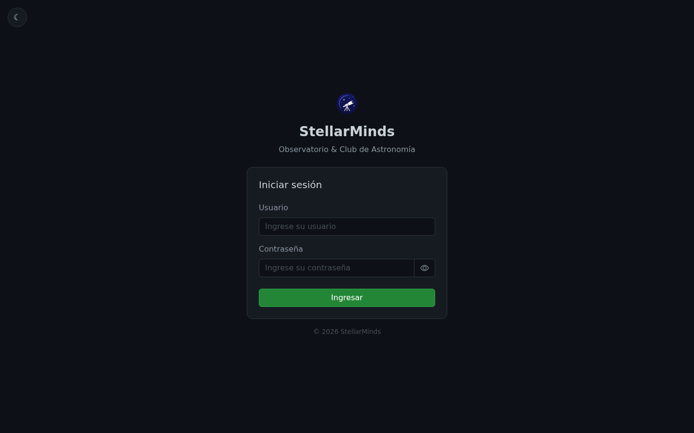
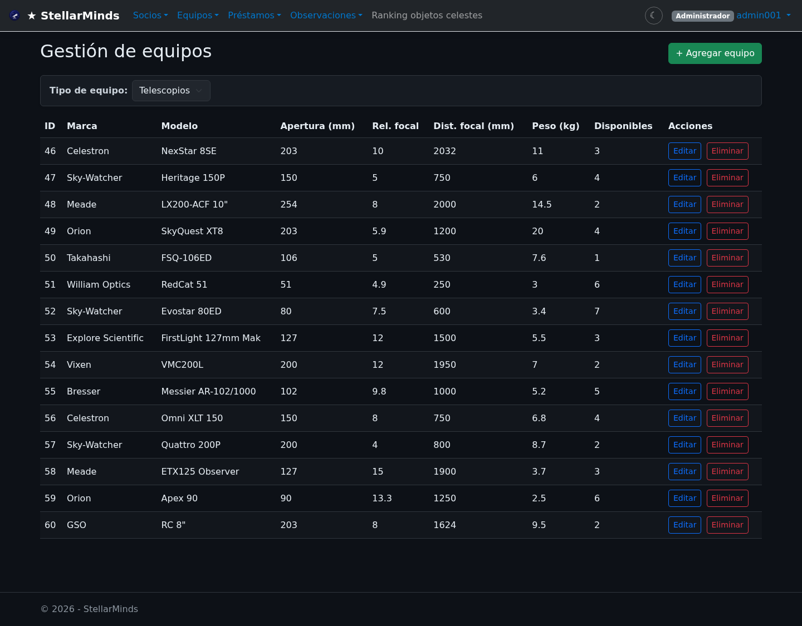
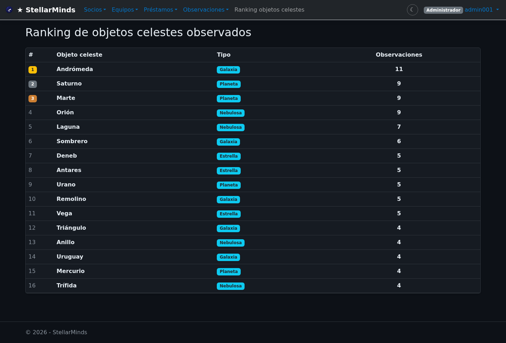
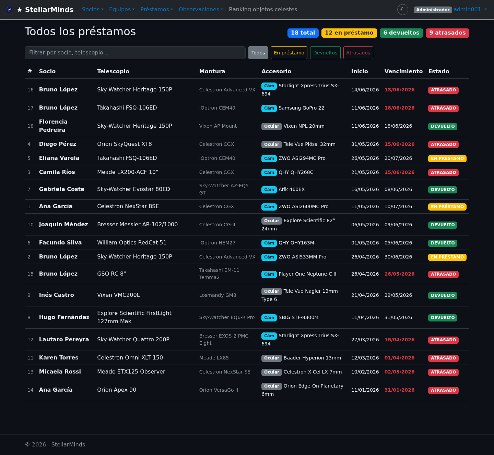
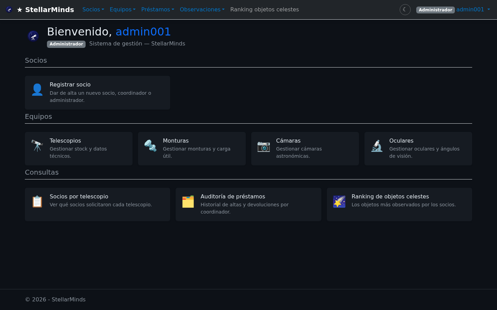
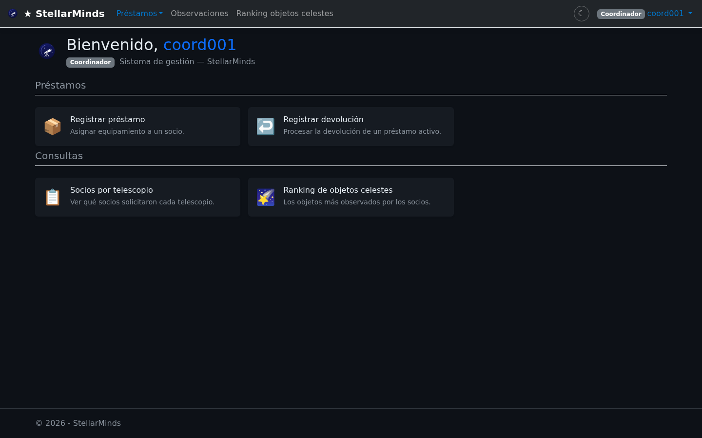
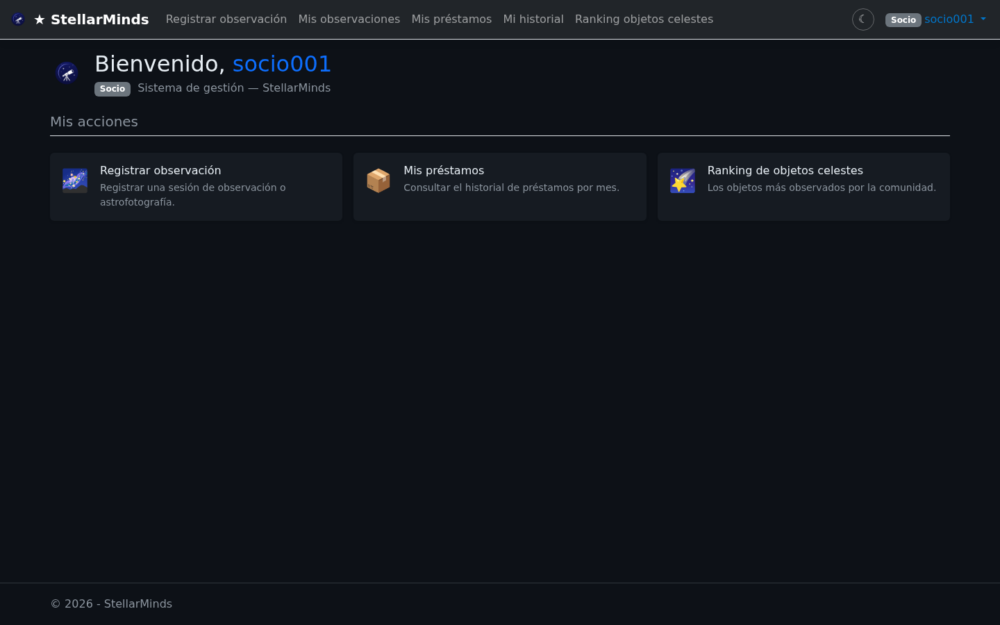

<h1 align="center">🔭 StellarMinds — Web (MVC)</h1>

<p align="center">
  Frontend web de <b>StellarMinds</b>, un sistema de gestión para un club de astronomía:
  socios, equipos, observaciones y préstamos.<br/>
  Aplicación <b>ASP.NET Core MVC</b> que consume la <a href="https://github.com/lcorbo121/StellarMinds-API-SOLID">API REST StellarMinds</a>.
</p>

<p align="center">
  
  
  
  
</p>

<p align="center">
  <a href="https://335305-364673-MVC.somee.com/"><b>🔗 Demo en vivo</b></a>
</p>

---

## 📋 Descripción

**StellarMinds** es una plataforma para administrar la operativa de un club de astronomía. Esta aplicación es el **frontend MVC**: renderiza las vistas, gestiona la sesión del usuario y se comunica con la **API REST** (proyecto [StellarMinds-API-SOLID](https://github.com/lcorbo121/StellarMinds-API-SOLID)) para todas las operaciones de datos.

> 🎓 Proyecto académico — Obligatorio de **Programación 3** (Analista en TI, Universidad ORT Uruguay).

---

## 📸 Capturas de pantalla

<table>
  <tr>
    <td width="50%" align="center">
      <b>Inicio de sesión</b><br/>
      
    </td>
    <td width="50%" align="center">
      <b>Gestión de equipos</b><br/>
      
    </td>
  </tr>
  <tr>
    <td width="50%" align="center">
      <b>Ranking de objetos celestes</b><br/>
      
    </td>
    <td width="50%" align="center">
      <b>Préstamos</b><br/>
      
    </td>
  </tr>
</table>

### 🔐 Vistas según el rol

La aplicación implementa **control de acceso por rol**: cada usuario ve un panel y un menú distintos.

<table>
  <tr>
    <td width="33%" align="center">
      <b>Administrador</b><br/>
      
    </td>
    <td width="33%" align="center">
      <b>Coordinador</b><br/>
      
    </td>
    <td width="33%" align="center">
      <b>Socio</b><br/>
      
    </td>
  </tr>
</table>

---

## ✨ Funcionalidades

- 👥 **Usuarios** — inicio de sesión y gestión de sesión.
- 🧑‍🚀 **Socios** — alta, listado y detalle de socios del club.
- 🔭 **Equipos** — gestión de telescopios, cámaras, oculares y monturas (alta/edición/detalle por tipo).
- 🌌 **Observaciones** — registro de observaciones astronómicas, listados y **ranking**.
- 📦 **Préstamos** — préstamo y devolución de equipos, auditoría e informes (socios por telescopio).
- 🔐 **Roles y permisos** — vistas y acciones diferenciadas para **Administrador**, **Coordinador** y **Socio**.

---

## 🛠️ Stack

- **.NET 10** · **C#**
- **ASP.NET Core MVC** + **Razor Views**
- **HttpClient** tipado para consumir la API REST
- **Sesión** basada en cookies (`HttpOnly`, `Secure`)

---

## 🏗️ Arquitectura

```
Navegador  ──►  StellarMinds-MVC (este repo)  ──►  StellarMinds-API-SOLID (REST API)  ──►  Base de datos
                 Controllers + Razor Views          Lógica de negocio (SOLID)
```

El frontend no accede a la base de datos directamente: toda la lógica y persistencia viven en la **API**.

---

## 🚀 Cómo ejecutarlo localmente

**Requisitos:** [.NET 10 SDK](https://dotnet.microsoft.com/download)

```bash
# 1. Clonar el repositorio
git clone https://github.com/lcorbo121/StellarMinds-MVC.git
cd StellarMinds-MVC/AppWeb/StellarMinds

# 2. Configurar la URL de la API (appsettings.json o variable de entorno)
#    "ApiBaseUrl": "https://localhost:7158/"   (o la URL de tu API publicada)

# 3. Restaurar y ejecutar
dotnet restore
dotnet run
```

La app queda disponible en `https://localhost:xxxx`. La URL de la API se configura con la clave **`ApiBaseUrl`** en `appsettings.json`.

> 💡 Necesitás la [API StellarMinds](https://github.com/lcorbo121/StellarMinds-API-SOLID) corriendo (local o publicada) para que la app funcione.

---

## 🔗 Proyecto relacionado

- [**StellarMinds-API-SOLID**](https://github.com/lcorbo121/StellarMinds-API-SOLID) — API REST (backend) construida aplicando principios SOLID.

---

<p align="center"><sub>Desarrollado por <a href="https://github.com/lcorbo121">Lucas Corbo</a></sub></p>
